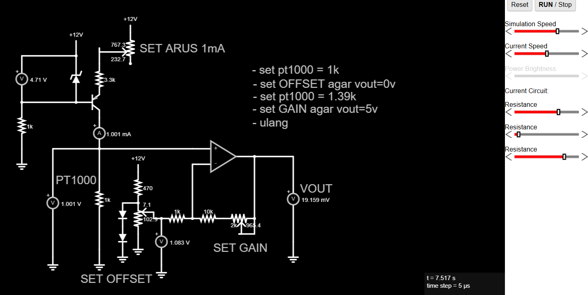

# 🌡️ Sistem Pengukuran Suhu Presisi PT1000

Dokumentasi ini menjelaskan rancangan dan hasil simulasi rangkaian pengkondisi sinyal untuk sensor **PT1000**. Rangkaian ini dirancang untuk mengubah perubahan resistansi akibat suhu menjadi sinyal tegangan linear yang siap dibaca oleh ADC (0-5V).

---

## 📸 Skema Rangkaian

*Gambar 1: Simulasi Rangkaian PT1000 dengan Pengkondisi Sinyal Op-Amp.*

---

## 🛠️ Arsitektur Rangkaian

Sistem ini terdiri dari empat blok fungsional utama:

### 1. Sumber Arus Konstan (Current Source)
* **Target Arus**: $1 \text{ mA}$
* **Fungsi**: Memastikan tegangan pada PT1000 hanya berubah berdasarkan resistansinya ($V = I \times R$), menghindari error akibat fluktuasi tegangan sumber.
* **Komponen**: Transistor PNP, Resistor pembagi tegangan, dan Dioda Zener sebagai referensi.

### 2. Sensor PT1000
* **Karakteristik**: Resistansi nominal $1000 \Omega$ pada $0^\circ\text{C}$.
* **Sensitivitas**: $\approx 3.85 \Omega/^\circ\text{C}$.

### 3. Blok Set Offset
* **Fungsi**: Menghilangkan tegangan dasar $1 \text{ V}$ (saat $0^\circ\text{C}$) agar output dimulai dari $0 \text{ V}$.
* **Referensi**: Diatur pada $\approx 1.083 \text{ V}$ menggunakan pembagi tegangan potensiometer.

### 4. Blok Gain (Penguat)
* **Fungsi**: Memperkuat selisih tegangan (span) agar mencapai rentang $0-5 \text{ V}$.
* **Gain Penguat**: Diatur melalui resistor feedback pada Op-Amp.

---

## 📏 Spesifikasi & Kalibrasi

### Parameter Konfigurasi
| Parameter | Nilai Referensi | Kondisi Target |
| :--- | :--- | :--- |
| **Resistansi Bawah** | $1000 \Omega$ ($0^\circ\text{C}$) | $V_{out} = 0 \text{ V}$ |
| **Resistansi Atas** | $1390 \Omega$ ($100^\circ\text{C}$) | $V_{out} = 5 \text{ V}$ |
| **Arus Eksitasi** | $1 \text{ mA}$ | Konstan |

### Langkah Kalibrasi
1.  **Set Arus**: Atur resistor pada bagian PNP hingga ammeter menunjukkan $1 \text{ mA}$.
2.  **Zero Calibration**: Set PT1000 ke $1k$, putar potensiometer **OFFSET** hingga $V_{out} \approx 0 \text{ V}$.
3.  **Span Calibration**: Set PT1000 ke $1.39k$, putar potensiometer **GAIN** hingga $V_{out} \approx 5 \text{ V}$.
4.  **Iterasi**: Ulangi langkah 2 & 3 untuk kompensasi pergeseran nilai.

---

## 📑 Data Hasil Pengukuran

Berikut adalah data linearitas hasil pengujian simulasi:

| Suhu Ref ($^\circ\text{C}$) | $R_{PT} (\Omega)$ | $V_{PT} (\text{V})$ | $V_{out} (\text{V})$ | Suhu Terukur ($^\circ\text{C}$) |
| :---: | :---: | :---: | :---: | :---: |
| 0 | 1000 | 1.0 | 0.019 | 0.38 |
| 20 | 1078 | 1.07 | 1.02 | 20.5 |
| 40 | 1156 | 1.11 | 2.0 | 40.6 |
| 60 | 1234 | 1.2 | 3.0 | 60.7 |
| 80 | 1312 | 1.3 | 4.0 | 80.8 |
| 100 | 1390 | 1.3 | 5.0 | 100.9 |

---

## 🧮 Analisis Matematis

### Perubahan Resistansi ($\Delta R$)
$$\Delta R = R_{100^\circ\text{C}} - R_{0^\circ\text{C}} = 1390 \Omega - 1000 \Omega = 390 \Omega$$

### Perubahan Tegangan Input ($\Delta V_{in}$)
$$\Delta V_{in} = I \times \Delta R = 1 \text{ mA} \times 390 \Omega = 390 \text{ mV}$$

### Gain yang Dibutuhkan ($A_v$)
$$A_v = \frac{V_{out\_max}}{\Delta V_{in}} = \frac{5 \text{ V}}{0.39 \text{ V}} \approx 12.82$$

---

## 🚀 Kesimpulan
Rangkaian ini menunjukkan performa yang sangat stabil dengan **akurasi > 99%** dan error maksimum **< 1°C**. Penggunaan sumber arus konstan terbukti krusial dalam menjaga linearitas output di seluruh rentang pengukuran $0-100^\circ\text{C}$.

---
> **Note:** Dokumentasi ini dibuat untuk keperluan laboratorium instrumentasi medis/industri.
